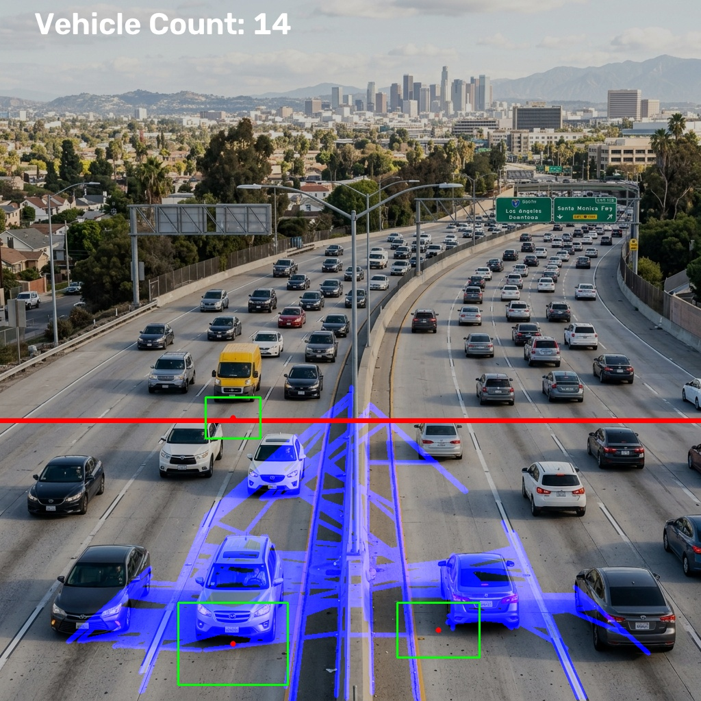

# Traffic Vision Analysis CLI

## Overview of the project
Traffic Vision Analysis is a fully automated, command-line executable Computer Vision pipeline. It processes traffic surveillance videos or images to perform real-time lane detection and vehicle counting. Built with Python and OpenCV, it leverages foundational image processing techniques like Background Subtraction, Edge Detection, and Hough Transforms to achieve high performance without needing specialized AI hardware.

## Features
- **Lane Detection**: Highlights road lanes in frames using region-of-interest masking and Hough Line Transforms.
- **Vehicle Counting**: Detects moving objects using MOG2 background subtraction and tracks them across a configured threshold line to maintain a vehicle count.
- **Modular Pipeline**: Clean architecture separating I/O handlers, detection algorithms, and CLI orchestration.
- **Video & Image Support**: Process static images or entire video feeds.

## Technologies/Tools used
- **Python 3.8+**: Core programming language.
- **OpenCV (cv2)**: Core Computer Vision library for all image processing, filtering, and analysis.
- **NumPy**: Used for efficient matrix and array operations.
- **PyTest**: Framework for unit testing the modules.

## Steps to install & run the project

### 1. Environment Setup
It is recommended to use a virtual environment.
```bash
python -m venv venv
```
Activate it:
- Windows: `.\venv\Scripts\activate`
- Mac/Linux: `source venv/bin/activate`

### 2. Install Dependencies
```bash
pip install -r requirements.txt
```

### 3. Run the CLI
The project is executed via `main.py`. You must specify an input file and the tasks to perform (`lane`, `vehicle`, or both).

**Basic Usage:**
```bash
python main.py --input path/to/video.mp4 --tasks lane vehicle --display
```

**Save output to a file:**
```bash
python main.py --input path/to/video.mp4 --output output.mp4 --tasks lane vehicle
```

**Help command:**
To see all available arguments:
```bash
python main.py --help
```

## Instructions for testing
The project includes unit tests for the core modules.
To run the tests, execute `pytest` in the root directory:
```bash
python -m pytest tests/
```

To test the command line execution manually, you can run the pipeline on the sample image located in `assets/`:
```bash
python main.py --input assets/original.jpg --output assets/processed.jpg --tasks lane vehicle
```

## Screenshots

### 1. Terminal Execution
```text
C:\TrafficAnalysis> python main.py --input assets/original.jpg --tasks lane vehicle
==================================================
Traffic Vision Analysis CLI
==================================================
Starting processing... (Input: assets/original.jpg)
Tasks: ['lane', 'vehicle']
Processing complete!
Final Vehicle Count: 14
```

### 2. Output Images
**Original Input:**


**Processed Output (Lane Detection):**

